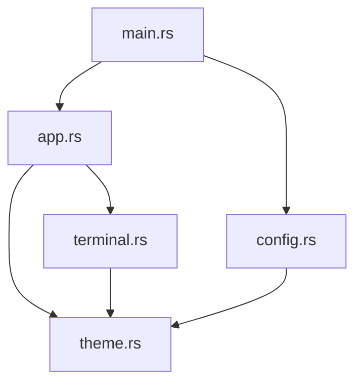

# Design Document

## Overview

The main.rs refactoring will transform a monolithic 3000+ line file into 4-5 focused modules, each with clear responsibilities. The refactoring will be done incrementally to ensure functionality is preserved at each step.

Based on analysis of the current code structure, the main components are:
- Catppuccin theme definitions and color handling
- Terminal emulation logic with ANSI sequence processing
- Configuration management
- Application state and UI rendering
- Main entry point and coordination

## Architecture

The refactored architecture will follow Rust module conventions with clear separation of concerns:

```
src/
├── main.rs              # Application entry point and coordination
├── theme.rs             # Catppuccin theme and color utilities
├── terminal.rs          # Terminal emulation and ANSI processing
├── config.rs            # Configuration loading and management
└── app.rs               # Application state and UI rendering
```

### Module Dependencies



## Components and Interfaces

### 1. theme.rs
**Responsibility:** Theme definitions, color constants, and color utility functions

**Public Interface:**
```rust
pub struct CatppuccinTheme { /* ... */ }
impl CatppuccinTheme {
    pub const FRAPPE: Self = /* ... */;
}
pub fn ansi_256_to_rgb(color_index: u8) -> egui::Color32;
```

**Contents:**
- `CatppuccinTheme` struct with all color definitions
- `ansi_256_to_rgb` function for ANSI color conversion
- Color utility functions

### 2. terminal.rs
**Responsibility:** Terminal emulation, ANSI sequence processing, and terminal cell management

**Public Interface:**
```rust
pub struct TerminalCell { /* ... */ }
pub struct TerminalEmulator { /* ... */ }
impl TerminalEmulator {
    pub fn new(rows: usize, cols: usize) -> Self;
    pub fn process_ansi_data(&mut self, data: &str);
    pub fn clear_screen(&mut self);
    // ... other public methods
}
```

**Contents:**
- `TerminalCell` struct and implementation
- `TerminalEmulator` struct and all its methods
- ANSI sequence parsing and handling
- Character width calculation and emoji handling
- Cursor movement and screen manipulation

### 3. config.rs
**Responsibility:** Configuration file loading, parsing, and default configuration

**Public Interface:**
```rust
pub struct AppConfig { /* ... */ }
pub struct AppSettings { /* ... */ }
pub struct TabConfig { /* ... */ }
pub fn load_config() -> AppConfig;
pub fn default_config() -> AppConfig;
```

**Contents:**
- Configuration structs (`AppConfig`, `AppSettings`, `TabConfig`)
- `load_config()` function
- `default_config()` function
- TOML parsing logic

### 4. app.rs
**Responsibility:** Application state management and UI rendering

**Public Interface:**
```rust
pub struct TerminalTab { /* ... */ }
pub struct AudioToolkitApp { /* ... */ }
impl AudioToolkitApp {
    pub fn new(config: AppConfig) -> Self;
}
```

**Contents:**
- `TerminalTab` struct and implementation
- `AudioToolkitApp` struct and implementation
- UI rendering logic
- Event handling
- Tab management

### 5. main.rs (refactored)
**Responsibility:** Application entry point and high-level coordination

**Contents:**
- `main()` function
- High-level application initialization
- Module imports and re-exports

## Data Models

### Configuration Models
```rust
// In config.rs
pub struct AppConfig {
    pub app: AppSettings,
    pub tabs: Vec<TabConfig>,
}

pub struct AppSettings {
    pub name: String,
    pub window_width: f32,
    pub window_height: f32,
}

pub struct TabConfig {
    pub title: String,
    pub command: String,
    pub args: Vec<String>,
}
```

### Terminal Models
```rust
// In terminal.rs
pub struct TerminalCell {
    pub character: char,
    pub color: egui::Color32,
    pub bold: bool,
}

pub struct TerminalEmulator {
    buffer: Vec<Vec<TerminalCell>>,
    cursor_row: usize,
    cursor_col: usize,
    rows: usize,
    cols: usize,
    current_color: egui::Color32,
    bold: bool,
}
```

### Application Models
```rust
// In app.rs
pub struct TerminalTab {
    title: String,
    config: TabConfig,
    emulator: TerminalEmulator,
    // ... other fields
}

pub struct AudioToolkitApp {
    tabs: Vec<TerminalTab>,
    focused_terminal: usize,
}
```

## Error Handling

Each module will handle errors appropriately:
- **config.rs**: Handle file I/O errors and TOML parsing errors gracefully, falling back to default configuration
- **terminal.rs**: Validate buffer bounds and handle malformed ANSI sequences safely
- **app.rs**: Handle PTY creation errors and UI rendering errors
- **theme.rs**: Provide safe color conversion with fallbacks

Error handling will use Rust's `Result` type where appropriate, with errors propagated to the caller or handled locally with sensible defaults.

## Testing Strategy

### Unit Testing
- Each module will have its own test module (`#[cfg(test)] mod tests`)
- **theme.rs**: Test color conversion functions and theme constants
- **terminal.rs**: Test ANSI sequence parsing, cursor movement, and character handling
- **config.rs**: Test configuration loading with valid/invalid TOML files
- **app.rs**: Test application state management and tab operations

### Integration Testing
- Test module interactions work correctly
- Verify that refactored application behaves identically to original
- Test configuration loading flows through to application correctly

### Manual Testing
- After each incremental split, manually test the application
- Verify all terminal functionality works (colors, cursor movement, text display)
- Confirm UI rendering and tab switching work correctly

## Migration Strategy

### Phase 1: Split into 2 files (main.rs + theme.rs)
1. Extract `CatppuccinTheme` and `ansi_256_to_rgb` to `theme.rs`
2. Update imports in `main.rs`
3. Test application functionality

### Phase 2: Extract terminal functionality (3 files total)
1. Extract `TerminalCell` and `TerminalEmulator` to `terminal.rs`
2. Update imports and dependencies
3. Test terminal emulation functionality

### Phase 3: Extract configuration (4 files total)
1. Extract config structs and functions to `config.rs`
2. Update imports in `main.rs` and `app.rs`
3. Test configuration loading

### Phase 4: Extract application logic (5 files total)
1. Extract `TerminalTab` and `AudioToolkitApp` to `app.rs`
2. Clean up `main.rs` to only contain entry point
3. Final testing and validation

### Phase 5: Final cleanup and optimization
1. Review all module interfaces and visibility
2. Add comprehensive documentation
3. Optimize imports and dependencies
4. Final comprehensive testing